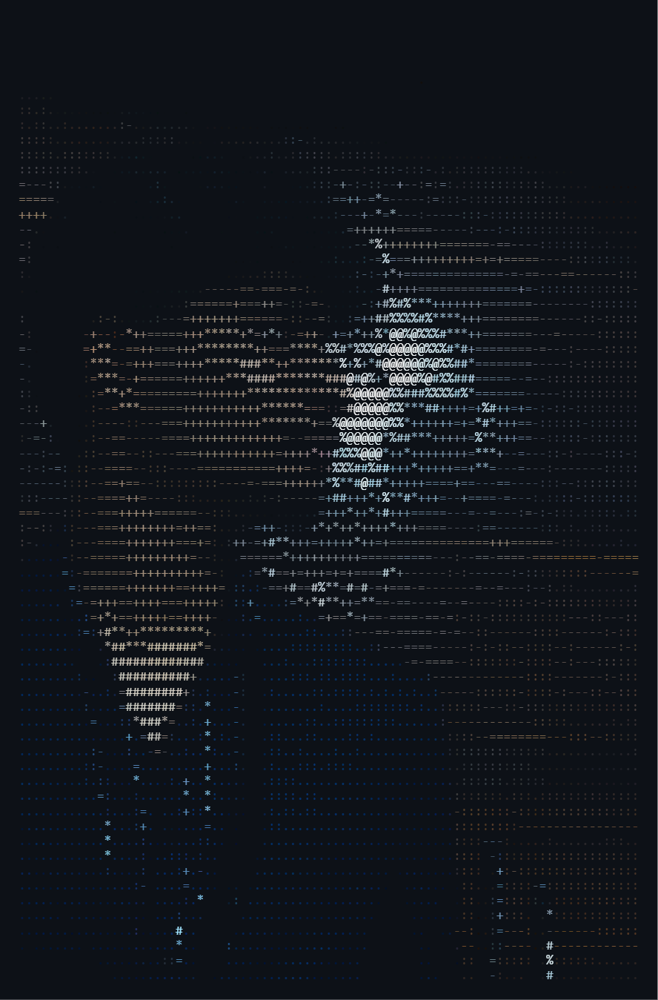

<table>
<tr>
<td width="35%" align="center">

</td>
<td width="65%">

# Devraj Naik

</td>
</tr>
</table>

## 👨‍💻 About Me

Hi! I'm **Devraj Naik**, I'm a Computer science undergraduate from PESU. Passionate about the latest techs and development.

**I work on:**
* 🛠️ Software Development
* 🖥️ AI and Machine Learning
* 📱 Full‑stack & App dev
* 🤖 Robotics and Digital Twins
---
## 🛠️ Tech Stack
### Languages

### Web

### Tools

---
## 📊 GitHub Stats

